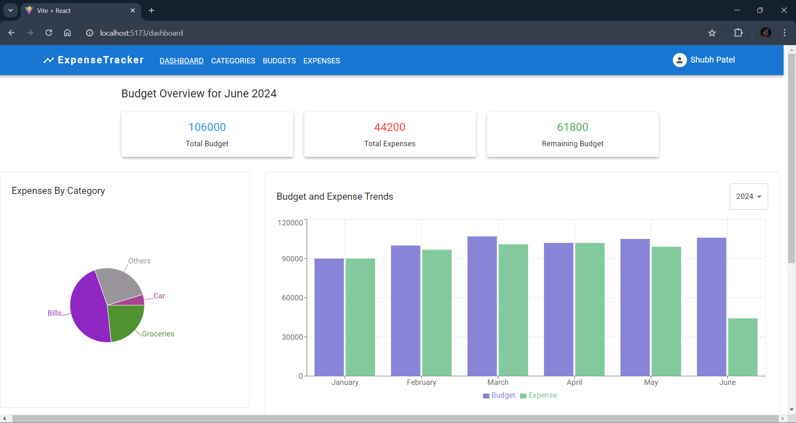

# This is a MERN Stack Monthly Expense Tracker Application

## Developed using the MERN Stack, Material UI, Redux Toolkit and RTK Query

### The application allows you to manage your monthly expenses and view your expense trends yearly and category wise.

